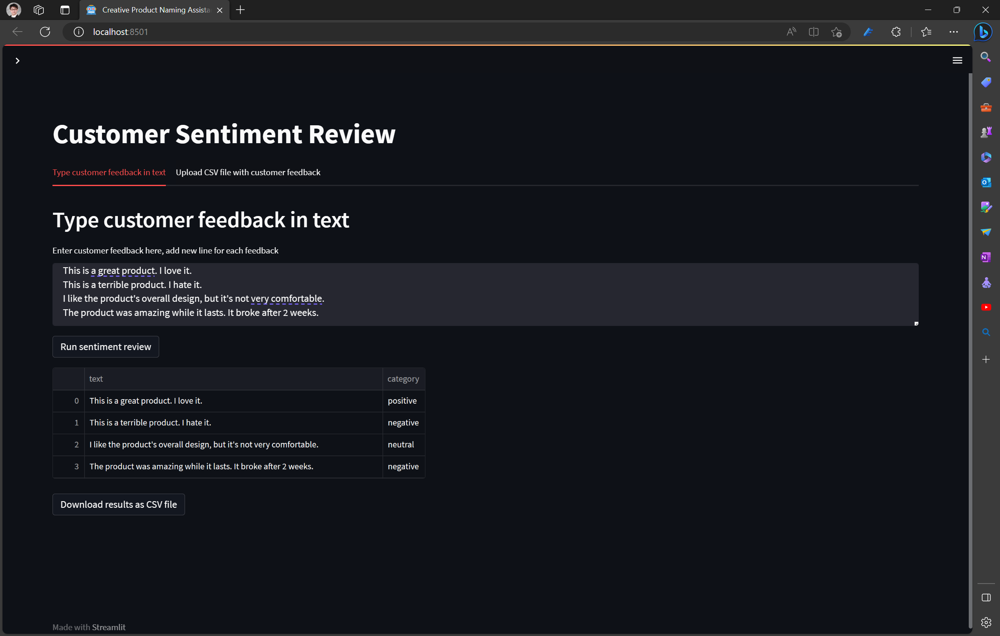

# Customer Sentiment Review

## Goal  

The goal of this project is to provide a quickstart guide for citizen developers who want to build web apps using Azure OpenAI and Streamlit. This guide will cover the basics of setting up and running the services, as well as some tips and tricks for making your app more user-friendly.
  
## How it Works  

Azure OpenAI is a cloud-based AI platform that provides natural language processing (NLP) capabilities. In this project, we will use the sentiment analysis feature of Azure OpenAI to analyze customer reviews and determine whether they are positive, negative, neutral, question, and answer.

Streamlit is a Python library that allows you to create interactive web apps with just a few lines of code. We will use Streamlit to create a simple web interface that will allow users to input a customer feedback and see the sentiment analysis results.

