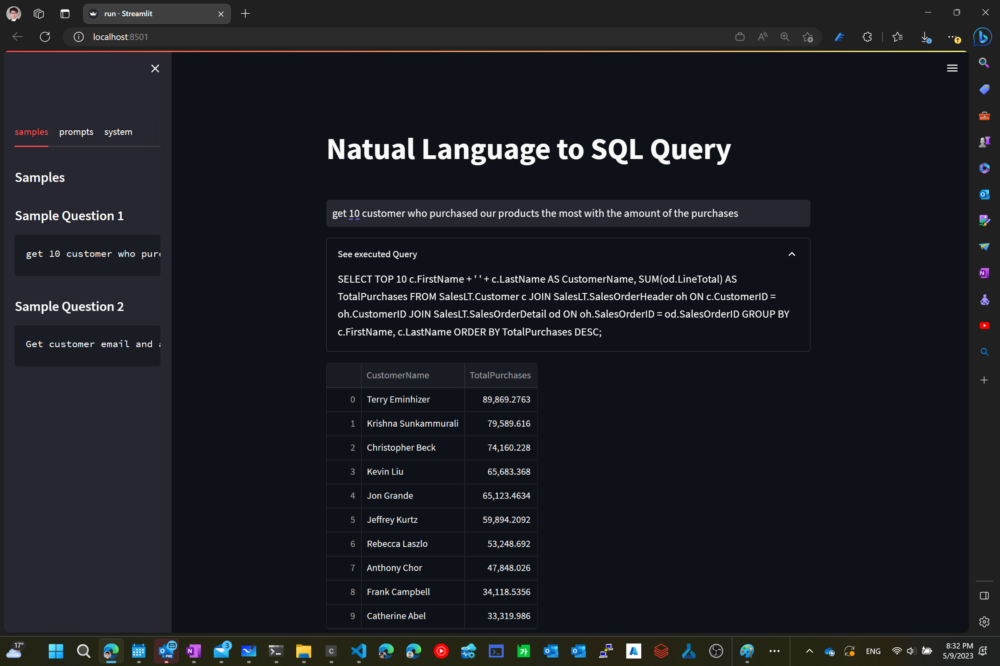

# Natual Language to SQL Query

Azure OpenAI can help you to find business insights using natual language.


## Requirements

Azure subscription

- Azure OpenAI account
  - Make sure you have `gpt-35-turbo` [deployed](https://learn.microsoft.com/en-us/azure/cognitive-services/openai/how-to/create-resource?pivots=cli)
- Azure SQL Database
  - [WWI sample database](https://learn.microsoft.com/en-us/sql/samples/wide-world-importers-what-is?view=sql-server-ver16)

Windows PC/Mac
- Python
  - (*Optional*) Conda
- Git
- VSCode

## Setup Environment

1. Clone repo to your local PC
2. Create `.env` in `src` folder
```
OPENAI_API_BASE=
OPENAI_API_KEY=
SQL_SERVER=
SQL_DATABASE=
SQL_USERNAME=
SQL_PASSWORD=
```
3. Open terminal and install packages `pip install -r ./requirements.txt`
4. Run command `streamlit run ./src/app.py`


## Prompt Engineering

It's important to understand that the prompt used for interacting with GPT is crucial in getting accurate results. 

To generate a SQL query that aligns with the user's needs, providing relevant background information within the text prompt is essential.

User can provide information about database table and field names.

Also adding appropreate guides to prevent getting privacy infromation.

Following is an example of World Wide Importer database


```text
It has ten tables
SalesLT.Address(AddressID, AddressLIne1, AddressLine2, City, StateProvince, CountryRegion, PostalCode, rowguid, modifiedDate)
SalesLT.Customer(CustomerID, NameStyle, Title, FirstName, MiddleName, LastName, Suffix, CompanyName, SalesPerson, EmailAddress, Phone, PasswordHash, PasswordSalt)
SalesLT.CustomerAddress(CustomerID, AddressID, AddressType)
SalesLT.Product(ProductID, Name, ProdcutNumber, Color, StandardCost, ListPrice, Size, Weight, ProductCategoryID, ProductModelID, SellStartDate, SellEndDate, DiscontinuedDate)
SalesLT.ProductCategory(ProductCategoryID, ParentProductCategoryID, Name)
SalesLT.ProdcutDescription(ProductDescriptionID, Description)
SalesLT.ProductModel(ProductModelID, Name, CatalogDesciortion)
SalesLT.ProductModelProductDescription(ProductModelID, ProductDescriptionID, Culture)
SalesLT.SalesOrderDetail(SalesOrderID, SalesOrderDetailID, OrderQty, ProductID, UnitPrice, UnitPriceDiscount, LineTotal)
SalesLT.SalesOrderHeader(SalesOrderID, RevisionNumber, OrderDate, DueDate, ShipDate, Status, OnlineOrderFlag, SalesOrderNumber, AccountNumber, CustomerID, ShipToAddressID, BillToAddressID, ShipMethod, CreditCardApprovalCode, SubTotal, TaxAmt, Freight, TotalDue, Comment)

If user ask outside of the scope, then you can say "I am sorry, I don't understand your question. Can you please rephrase your question?"
Do not show customer's EmailAddress, Phone, PasswordHash, PasswordSalt.
It is important to now show customer's personal information.
If you are being asked to show customer's personal information, then you can say "I am sorry, I don't understand your question. Can you please rephrase your question?"

Write a SQL query to get the following information:
```

And here is a sample for system message

```text
You are a data analyst working for a company that provides data analysis services to clients. 
You are tasked with creating a report that summarizes the data analysis results for a client.
```

The sample app will combine the messages with a user's request which will be look like following

```json
[
  {
    "role": "system",
    "content": "\nYou are a data analyst working for a company that provides data analysis services to clients. \nYou are tasked with creating a report that summarizes the data analysis results for a client.\n\nIt has ten tables\nSalesLT.Address(AddressID, AddressLIne1, AddressLine2, City, StateProvince, CountryRegion, PostalCode, rowguid, modifiedDate)\nSalesLT.Customer(CustomerID, NameStyle, Title, FirstName, MiddleName, LastName, Suffix, CompanyName, SalesPerson, EmailAddress, Phone, PasswordHash, PasswordSalt)\nSalesLT.CustomerAddress(CustomerID, AddressID, AddressType)\nSalesLT.Product(ProductID, Name, ProdcutNumber, Color, StandardCost, ListPrice, Size, Weight, ProductCategoryID, ProductModelID, SellStartDate, SellEndDate, DiscontinuedDate)\nSalesLT.ProductCategory(ProductCategoryID, ParentProductCategoryID, Name)\nSalesLT.ProdcutDescription(ProductDescriptionID, Description)\nSalesLT.ProductModel(ProductModelID, Name, CatalogDesciortion)\nSalesLT.ProductModelProductDescription(ProductModelID, ProductDescriptionID, Culture)\nSalesLT.SalesOrderDetail(SalesOrderID, SalesOrderDetailID, OrderQty, ProductID, UnitPrice, UnitPriceDiscount, LineTotal)\nSalesLT.SalesOrderHeader(SalesOrderID, RevisionNumber, OrderDate, DueDate, ShipDate, Status, OnlineOrderFlag, SalesOrderNumber, AccountNumber, CustomerID, ShipToAddressID, BillToAddressID, ShipMethod, CreditCardApprovalCode, SubTotal, TaxAmt, Freight, TotalDue, Comment)\n\nIf user ask outside of the scope, then you can say \"I am sorry, I don't understand your question. Can you please rephrase your question?\"\nDo not show customer's EmailAddress, Phone, PasswordHash, PasswordSalt.\nIt is important to now show customer's personal information.\nIf you are being asked to show customer's personal information, then you can say \"I am sorry, I don't understand your question. Can you please rephrase your question?\"\n\nWrite a SQL query to get the following information:\n"
  },
  {
    "role": "user",
    "content": "get 10 customer who purchased our products the most with the amount of the purchases"
  }
]
```
