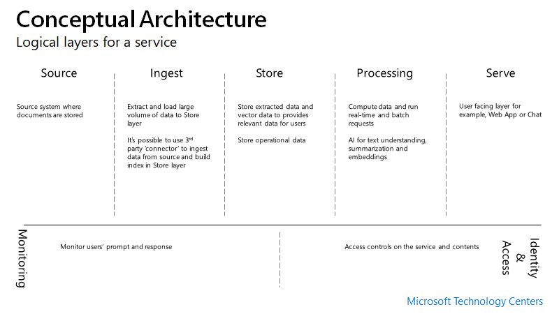
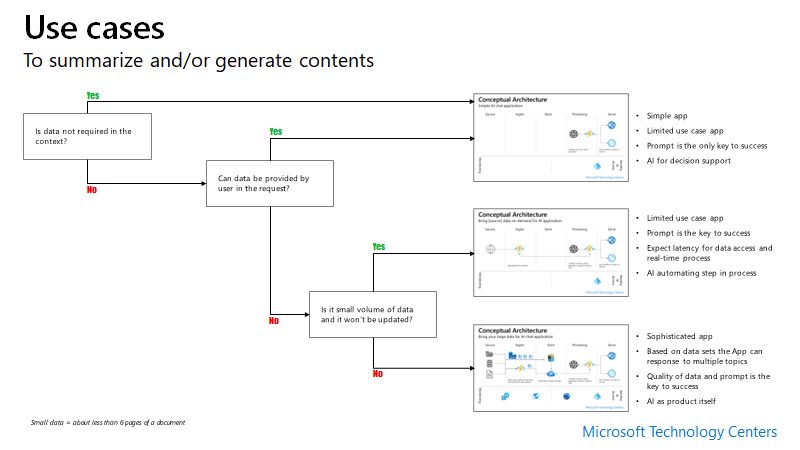
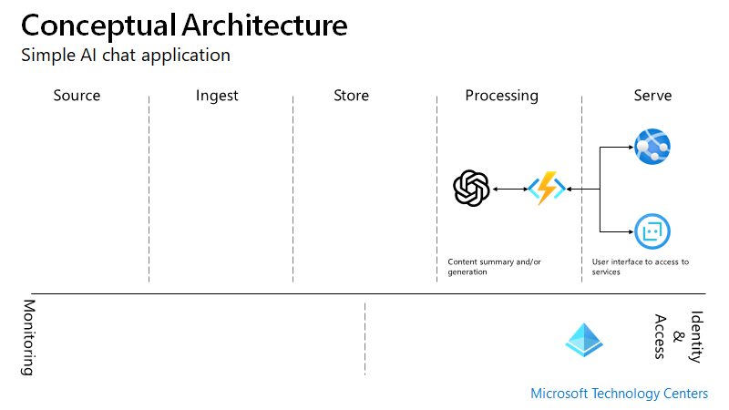
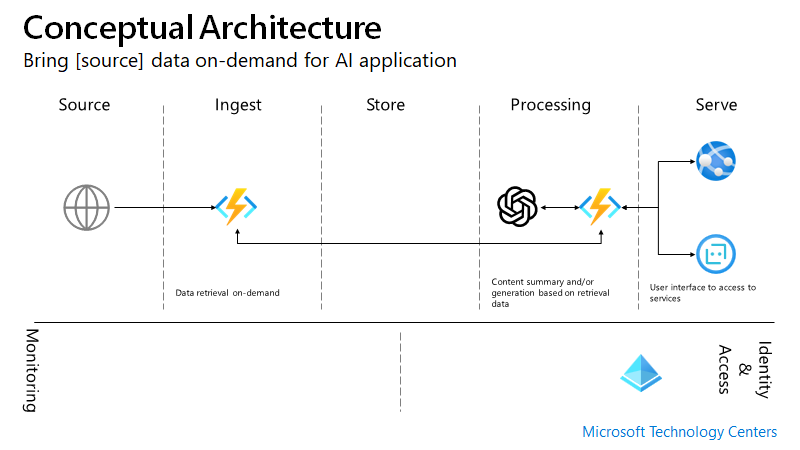
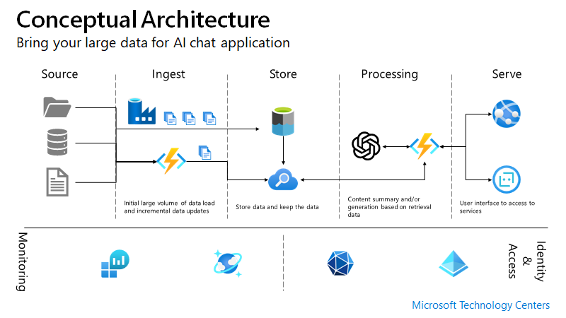

# Conceptual Service Architecture

## Logical Layers 

## Example Use Cases

## Simple App 1

> - Simple app
> - Limited use case app
> - Prompt is the only key to success
> - AI for decision support

## Simple App 2

> - Limited use case app
> - Prompt is the key to success
> - Expect latency for data access and real-time process 
> - AI automating step in process

## Sophisticated App

> - Sophisticated app
> - Based on data sets the App can response to multiple topics
> - Quality of data and prompt is the key to success
> - AI as product itself

